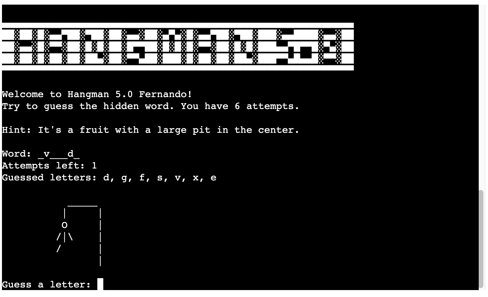

# HANGMAN 5.0!

HELLO, Welcome to HANGMAN 5.0,  
I made the decision to create a game after learning Python. During that time, I came up with the idea of creating the hangman game. Like this i can creat a google sheet for the game pick up the words.

The game is designed to be enjoyable and bring back pleasant memories for its users.

[See deployed website](https://hangman50-78a96d76c638.herokuapp.com/)

## Table of content

- [Feed the Snake!](#feed-the-snake)
  - [Table of content](#table-of-content)
  - [Design and User Experience](#design-and-user-experience)
    - [Design](#design)
  - [Features](#features)
    - [Footer](#footer)
    - [Home Page](#home-page)
    - [Game Page](#game-page)
    - [404 Error Page](#404-error-page)
  - [Testing](#testing)
    - [Tests](#tests)
    - [Validator Testing](#validator-testing)
    - [Fixed Bugs](#fixed-bugs)
    - [Unfixed Bugs](#unfixed-bugs)
    - [Performance](#performance)
  - [Deployment](#deployment)
    - [Live Website](#live-website)
  - [Credits](#credits)
    - [Content](#content)
    - [Media](#media)
  - [Technologies used](#technologies-used)

## Design and User Experience

### Design

The design of the website is minimalist, yet fun. The user can experience the game on a already creat tamplate from my school @CodeInstitute.

## Features

 - There are just one page for the python can run

- Introduction and rules section:
  - In this section we can see in a big way the name of the game. a message of welcome and the rules the game. The player can find the first interaction for put player name.

- Main Game Section:
  - After the player insert the name he can start play, appear the first word for guess. the player need start put one letter for see if the guess its right or wrong. In this area the player can see one hit to find more easy the word. Appear to one image of the hangman, he start appear when the player lose 1 guess.

  - If the user guesses a correct letter, the dash is replaced with the guess and the letter go to "Guessed letters:", the number of lives and hangman image stays the same.

  - An error message will appear if the user enters anything other than a letter for their guess.

  - When the player lose the guess the Hangman image start to builded.

  - In the end when the player lost all the guess its game over and the Hangman image appear complete and one message ""Game over Fernando! The secret word was
'guess'". And one question for yes/no for "Do you want play again? 

  - When the player guess the word, appear one message "Congratulations (name of player)! You guessed the word correctly." And one question for yes/no for "Do you want play again? 

  - After the play answer the play again question:
    - If the player say yes the game start again with another random word. 
    - If the player say no one message gone display of thank you:

## Testing

To test my game I have opened it on different devices, to see if it was working as expected.

- Browser tested:
  - Chrome
  - Firefox
  - Safari

- Operating systems:
  - Android
  - iOS

### Validator Testing

- CI Python Linter
  - No errors were returned when passing the final version through the [CI Python Linter](https://pep8ci.herokuapp.com/#)

### Fixed Bugs
- Long lines on Python code:
  - The solution was to create strings with the variable name outside the function.
- The prints weren't showing:
  - The "Wrong guess" or "Correct guess!" prints don't appear on the console, so I've created a 1-minute sleep time so that the player can see the prints.

### Unfixed Bugs

### Game in action

- Here are some screenshots of the game in action

  
 Desktop 

  
- Home page:

   

- Game page:

   

- 404 Error page:

   

## Deployment
- The deployment was done through heroku. following the steps below:
  - Preparing for deployment:
      - Add a new line character ("\n") at the end of each input request.
      - Create a list of dependancies to go into the requirements.txt file by typing "pip3 freeze > requirements.txt" into the terminal.
  - Deployment:
      - Log into Heroku and in the dashboard, press the "Create new app" button.
      - Click on the "Settings" tab, scroll down to the "Reveal Config Vars" button and click on it to create config vars.
      - Add the first config vars. The key is "CREDS" and value is the contents of the creds.json file.
      - Add the second config vars. The key is "PORT" and value is "8000".
      - Click on the "Add buildpack" button on the same page and add the buildpacks "python" and "node.js" in this order.
      - Click on the "Deploy" tab.
      - Choose the "GitHub" deployment method and then connect to GitHub.
      - Scroll down to the "Automatic deploys" section, select the "main" branch to deploy from and then press the "Enable Automatic Deploys" button to deploy the project.

### Live Website

The live link can be found here - [Live Website](https://hangman50-78a96d76c638.herokuapp.com/)

## Credits

### Content

- Hangman 5.0 big title from - [Text Editor](https://texteditor.com/)
- Learning to create the game with - [Python for Beginners](https://www.pythonforbeginners.com/code-snippets-source-code/game-hangman) and [Hashtag](https://www.hashtagtreinamentos.com/jogo-da-forca-em-python) and [DIO](https://www.dio.me/articles/jogo-da-forca-em-python)

## Technologies used

- Python
- GitHub
- CodeAnywhere
- Heroku
- Google API (sheets)