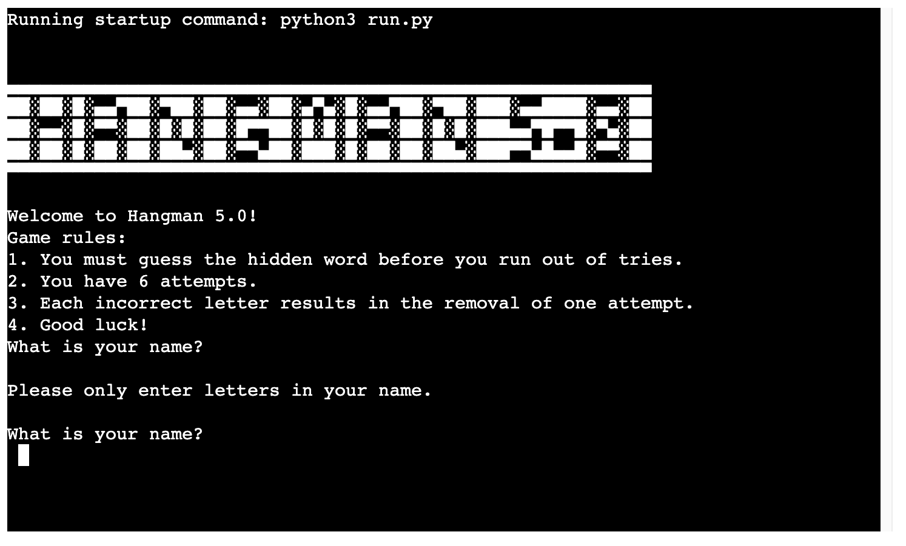
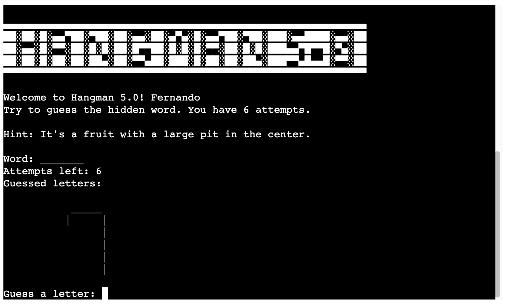
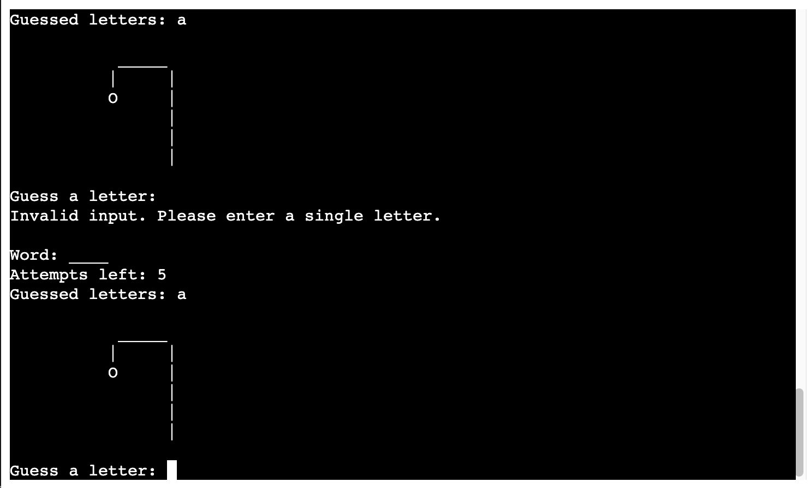
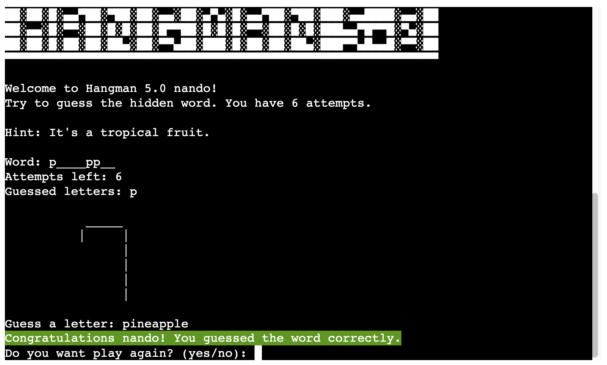

# HANGMAN 5.0!

HELLO, Welcome to HANGMAN 5.0,  

I decided to create a game after learning Python. During that time, I had the idea of creating a hangman's game. So I can create a Google spreadsheet for the game can pick up the words.

The game is designed to be fun and bring back pleasant memories for its users.

[See deployed website](https://hangman50-78a96d76c638.herokuapp.com/)

## Table of content

- [HANGMAN 5.0!](#hangman-5.0!)
  - [Table of content](#table-of-content)
  - [Design and User Experience](#design-and-user-experience)
    - [Design](#design)
    - [Wireframes](#wireframes)
  - [Features](#features)
  - [Testing](#testing)
    - [Tests](#tests)
    - [Validator Testing](#validator-testing)
    - [Fixed Bugs](#fixed-bugs)
    - [Unfixed Bugs](#unfixed-bugs)
  - [Deployment](#deployment)
    - [Live Website](#live-website)
  - [Credits](#credits)
    - [Content](#content)
  - [Technologies used](#technologies-used)

## Design and User Experience

### Design

The design of the website is minimalist but fun. The user can try out the game on a printed circuit board already created by my school @CodeInstitute.

### Wireframes

## Features

 - There are just one page for the python can run

- Introduction and rules section:
  - In this section, we can mostly see the name of the game, a welcome message and the rules of the game. The player can find the first interaction to enter the player's name.

- When the player write the play name:
  - when the player writes a value other than letters in the middle of the name, an error will appear asking for letters only. 

- Main Game Section:
  - Once the player has entered their name they can start playing, the first word to guess appears. The player needs to start placing a letter to see if the guess is right or wrong. In this area the player can see a hit to find out the word more easily. An image of the hangman appears, he starts to appear when the player loses 1 guess.

  - If the user guesses a letter correctly, the dash is replaced by the guess and the letter moves to "Letters guessed:", the number of lives and the image of the executioner remain unchanged.

  - An error message will appear if the user enters anything other than a letter for their guess.

  - When the player loses the guess, the image of the hangman begins to build.

  - At the end, when the player loses all their guesses, the game ends and the image of the hangman appears complete with the message "Game over (player_name)! The secret word was
(guess)". And a yes/no question to "Do you want to play again? 

  - When the player guesses the word, a message appears "Congratulations (player's name)! You guessed the word correctly". And a yes/no question to "Do you want to play again? 

  - After the player, answer the question "Play again":
    - If the player says yes, the game starts again with another random word. 
    - If the player says "no" (or another letter), a thank you message is displayed:

- Other Features:
  - The Game takes the words for the game from a google API (google sheets), I create a list with the name of the fruit and a short description to help the player make the correct guess. 

- All word in one time:
  - To make the game more dynamic I've created a variable for the game, when the player already knows the word can match all the words and try to guess instead of matching letter by letter.

## Testing

To test my game I have opened it on different devices, to see if it was working as expected.
I have tested all possible outcomes of the game. 

### Tests
- Browser tested:
  - Chrome
  - Firefox
  - Safari

- Operating systems:
  - Android
  - iOS

### Validator Testing

- CI Python Linter
  - No errors were returned when passing the final version through the [CI Python Linter](https://pep8ci.herokuapp.com/#)

### Fixed Bugs
- Long lines on Python code:
  - The solution was to create strings with the variable name outside the function.
- The prints weren't showing:
  - The "Wrong guess" or "Correct guess!" prints don't appear on the console, so I've created a 1-minute sleep time so that the player can see the prints.

### Unfixed Bugs
  - none
  
## Deployment
- The deployment was done through heroku. following the steps below:
  - Preparing for deployment:
      - Add a new line character ("\n") at the end of each input request.
      - Create a list of dependancies to go into the requirements.txt file by typing "pip3 freeze > requirements.txt" into the terminal.
  - Deployment:
      - Log into Heroku and in the dashboard, press the "Create new app" button.
      - Click on the "Settings" tab, scroll down to the "Reveal Config Vars" button and click on it to create config vars.
      - Add the first config vars. The key is "CREDS" and value is the contents of the creds.json file.
      - Add the second config vars. The key is "PORT" and value is "8000".
      - Click on the "Add buildpack" button on the same page and add the buildpacks "python" and "node.js" in this order.
      - Click on the "Deploy" tab.
      - Choose the "GitHub" deployment method and then connect to GitHub.
      - Scroll down to the "Automatic deploys" section, select the "main" branch to deploy from and then press the "Enable Automatic Deploys" button to deploy the project.

### Live Website

The live link can be found here - [Live Website](https://hangman50-78a96d76c638.herokuapp.com/)

## Credits

### Content

- Hangman 5.0 big title from - [Text Editor](https://texteditor.com/)
- Learning to create the game with - [Python for Beginners](https://www.pythonforbeginners.com/code-snippets-source-code/game-hangman) and [Hashtag](https://www.hashtagtreinamentos.com/jogo-da-forca-em-python) and [DIO](https://www.dio.me/articles/jogo-da-forca-em-python)

## Technologies used

- Python
- GitHub
- CodeAnywhere
- Heroku
- Google API (sheets)
- Python Library´s